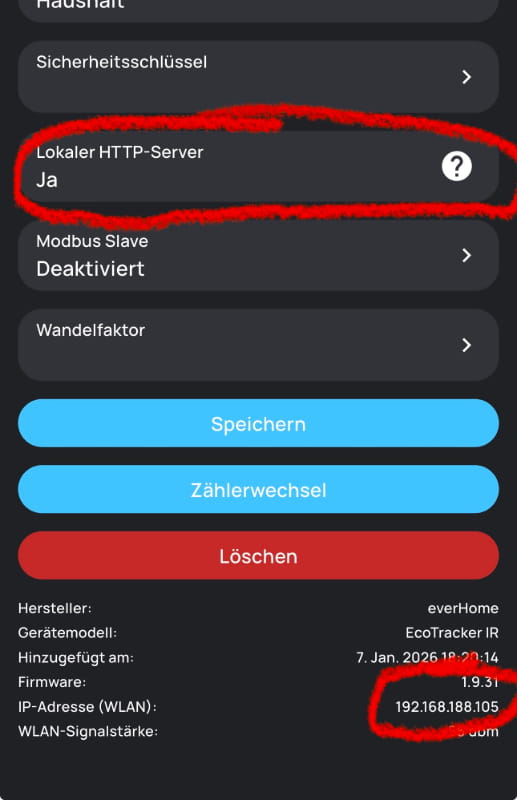

# Ecotracker Home Assistant Integration

Give me a tip: [paypal.me/StefanSeeger](https://www.paypal.com/paypalme/StefanSeeger)

Custom integration for Ecotracker energy monitoring device. It directly accessed the local HTTP server.

## Prerequisite

Ecotracker must have the local HTTP server activated

## Installation

### Prerequisites

1. Make sure your ecotracker is reachable in the local network via (http://your.local.ip.address/v1/json).
1. If not, please activate the "Local http server" of your Ecotacker device

### HACS (Recommended)

1. Add this repository as a custom repository in HACS:
   - Go to HACS > Integrations
   - Click the three dots in the top right
   - Select "Custom repositories"
   - Add the repository URL and select "Integration" as the category
2. Click "Install"
3. Restart Home Assistant

### Manual Installation

1. Copy the `custom_components/ecotracker` folder to your Home Assistant's `custom_components` directory
2. Restart Home Assistant

## Configuration

1. Go to Settings > Devices & Services
2. Click "+ Add Integration"
3. Search for "Ecotracker"
4. Enter your device's IP address
5. Set the polling interval (default: 60 seconds, range: 1-86400 seconds)

### Changing Settings

To change the polling interval after setup:

1. Go to Settings > Devices & Services
2. Find your Ecotracker device
3. Click "Configure"
4. Update the polling interval and IP address as needed

## Features

- Configurable polling interval (1-86400 seconds, default: 60 seconds)
- Multiple sensors:
  - Power (W)
  - Power average (last 60 seconds)
  - Power phase 1
  - Power phase 2
  - Power phase 3
  - Energy In (kWh)
  - Energy Out (kWh)
- Compatible with Home Assistant Energy Dashboard
- Config flow UI for easy setup
- Options flow for changing settings without re-adding the integration

## Sensors

- `sensor.ecotracker_power` - Current power consumption in Watts
- `sensor.ecotracker_power_phase_1` - Power consumption of phase 1 in Watts
- `sensor.ecotracker_power_phase_2` - Power consumption of phase 2 in Watts
- `sensor.ecotracker_power_phase_3` - Power consumption of phase 3 in Watts
- `sensor.ecotracker_power_average` - Average power consumption (last 60 seconds)
- `sensor.ecotracker_energy_in` - Total energy imported in Watt-hours
- `sensor.ecotracker_energy_out` - Total energy exported in Watt-hours
